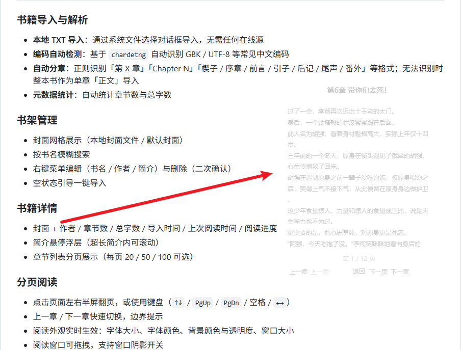
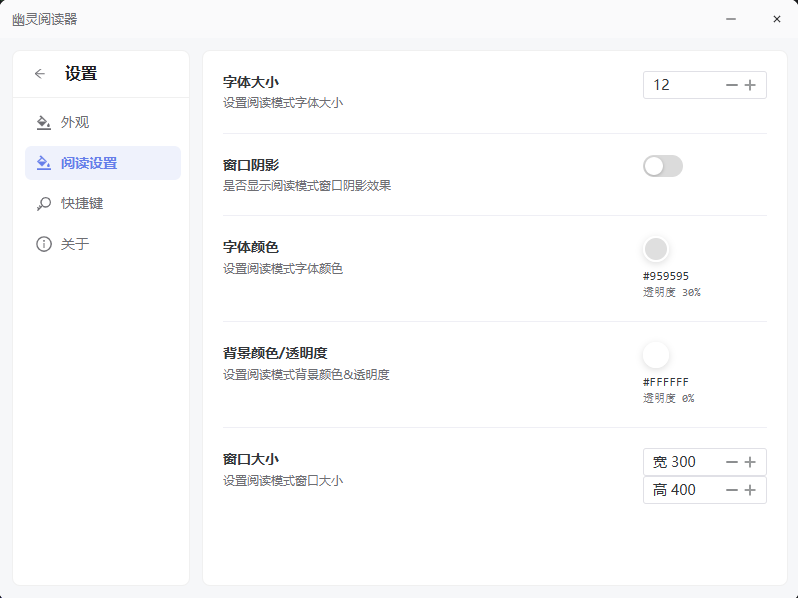
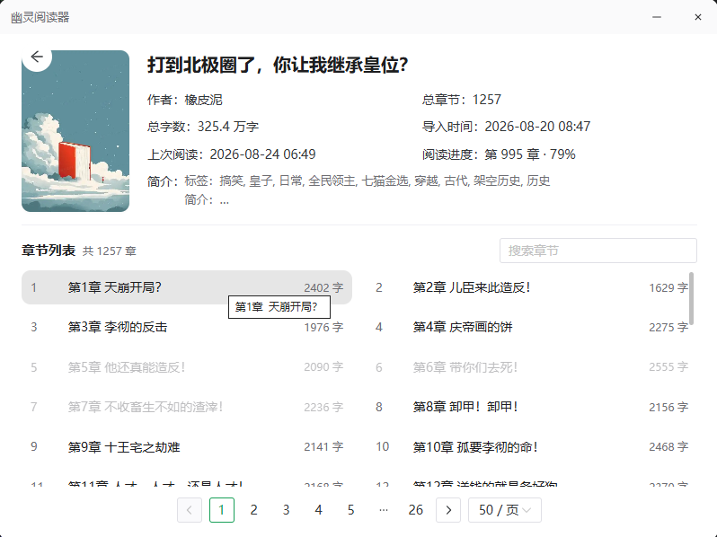

# 做了一款不联网、不弹广告的阅读器，只想把阅读还给你

> 一款安静、本地优先的桌面小说阅读器。没有账号体系，没有信息流，没有"猜你喜欢"。

---

## 一、你多久没读完一本小说了？

上周末，我想翻出那本放在收藏夹里很久的小说好好看完。

打开手机里的阅读 App，弹窗先是让我"领 7 天会员"；点掉，进首页，"智能推荐" 把几本我没点过的书推到最前面；翻到我的书架，三条横幅广告横在书封中间；点开小说，正文第一行下面又是一行小字"开通会员享纯净阅读"。

五分钟过去了，我一个字没读。

我突然意识到——我们不是"没时间读书"，而是被一群**根本不在乎你在读什么**的产品，挤掉了读书的时间。

所以我做了 **幽灵阅读器 · Stealth Reader**。它干一件事：**让你安静地读完一本书。**

---

## 二、它是一台"反 App" 的阅读器

第一眼看到它，你会觉得"这也太素了"。

**没有账号。** 安装即用，不绑手机、不绑邮箱、不绑微信。
**没有联网。** 所有数据都存在本机 SQLite，离线可用，拔网线也能读。
**没有信息流。** 没有任何"猜你喜欢"、没有排行榜、没有编辑推荐。
**没有广告。** 不是"暂时没有"，是从代码层就不留广告位。

它不是"克制"，是"根本不做"。

> 在一切都试图争夺你注意力的年代，它选择沉默。

---

## 三、它会"隐身"——把屏幕还给文字

「幽灵」不是噱头，是这个产品最核心的设计语言。

阅读窗口支持 **透明背景 + 圆角毛玻璃外观**，可以任意拖拽，可以置顶。把它放在屏幕一角，半透明地浮在你的工作窗口之上，文字静静铺开。

不打扰，也不被遮蔽。你可以一边干活一边用余光追小说——**它属于你，但不必挡住任何属于你的东西。**

外观全部可调：字体大小、字体颜色、背景颜色与透明度、窗口大小、阴影开关。

---

## 四、书架与书，是它的全部界面

打开它，看到的就是**一个安静的图书馆**。

- **封面网格展示**，一眼看完全部藏书
- **按书名模糊搜索**，找不到的书两秒定位
- **右键即可编辑书名、作者、简介**，删除有二次确认
- **空状态一键导入**，新书 30 秒入架

点进一本书，封面、作者、章节数、总字数、上次读到哪儿…… 全部摆在你面前，**没有比这更复杂的"信息架构"**。

章节列表支持**每页 20 / 50 / 100** 切换，简介悬停即看，章节标题可搜索。

---

## 五、它把"读"这件事，做到不能再简单

- **点屏幕左/右半屏翻页**，符合直觉
- **键盘全支持**：`↑↓` / `PgUp` / `PgDn` / 空格 / `←→`，单手就能翻
- **上一章 / 下一章** 一键切换，边界有提示
- **阅读外观实时生效**，调字号、颜色，秒级响应

它连"工具栏"都不做常驻——读完一节，界面只剩**字和留白**。

---

## 六、智能解析：一次导入，自动分章

你从网上下载的 TXT 小说，最怕两件事：**乱码**和**章节混乱**。

它做了两件安静但扎实的事：

- 基于 `chardetng` **自动识别 GBK / UTF-8 等编码**，打开不再乱码
- 用正则智能识别「第 X 章」「Chapter N」「楔子 / 序章 / 前言 / 引子 / 后记 / 尾声 / 番外」等格式，**自动切好章节目录**

导入完成，顺手帮你统计**章节数**和**总字数**——读完整本要花多久，你心里有数。

---

## 七、它凭什么又轻又快？

- **桌面壳 Tauri 2** —— 相比 Electron，安装包和内存占用大幅缩减
- **前端 Vue 3 + TypeScript + Vite + Naive UI** —— 现代、克制、不臃肿
- **后端 Rust** —— `sqlx` + SQLite 存储、`chardetng` 编码检测、`regex` 智能分章
- **状态管理 Pinia + 持久化插件** —— 设置跨会话保存，关掉再开还是你习惯的样子
- **GitHub Actions 多平台构建** —— Windows / macOS 一键出包

Rust 负责最重的解析与存储，Vue 负责最顺滑的界面。**各司其职，没有冗余。**

---

## 八、它还会更"幽灵"

目前还在持续开发：

- **老板键**：系统级全局快捷键，一键显隐
- **系统托盘 + 伪装图标**：在任务栏上更像"普通应用"
- **极小悬浮窗 + 鼠标穿透**：真正的"幽灵模式"
- **EPUB 解析支持**：不止 TXT
- **主题完全体**：浅色 / 深色 / 跟随系统
- **多设备进度同步**：WebDAV / 局域网
- **语音朗读（TTS）、书摘 / 笔记**

> 工具应该服务于阅读，而不是服务于商业。这是它的初心，也希望是它一直没变的样子。

---

## 九、写在最后

在"流量为王"的年代，做一款拒绝流量、拒绝数据采集的阅读器，多少有点逆流而上的意思。

但我始终觉得，**读书是一件私事**。

你不该被算法推着走，不该被广告打断，不该被账号绑定，更不该被"今日已阅读 0 / 5 分钟"这种 KPI 绑架。

幽灵阅读器是**开源的**。如果你也喜欢这种安静的产品哲学，欢迎去 GitHub 体验、Star 或参与贡献。

> 愿每一本书，都值得被安静地读完。

---

### 关于项目

- **项目名**：幽灵阅读器 · Stealth Reader
- **技术栈**：Tauri 2 · Vue 3 · TypeScript · Rust · SQLite
- **平台支持**：Windows / macOS
- **开源许可**：MIT
- **GitHub**：（请在此处替换为你的仓库地址）

### 免责声明

本项目仅支持本地文件导入，不内置任何在线书源或下载功能。请尊重版权，仅使用您拥有合法权利的书籍内容。
